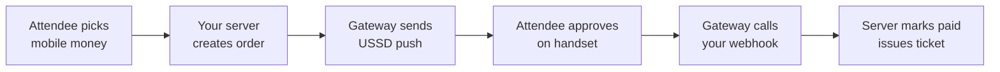

# Neurotech Events Feature Benchmark

2026-09-22 · @bryan

## Summary

Copy pretix and Ti.to, not Eventbrite. Eventbrite is a consumer marketplace that sells your attendees to other events and takes a cut; pretix and Ti.to are organiser-controlled ticketing for people who run their own branded events. That is what Neurotech Africa is doing, so it is the right model.

Four gaps matter more than everything else combined:

1. **No discount codes.** Every benchmark has them. It is the cheapest revenue feature available to you and you have nowhere to put a sponsor allocation, an early-bird push or a student rate that is not already a whole ticket tier.
2. **No waitlist.** You already track `sold` against `capacity` and already block sold-out tiers. The demand signal is being thrown away at exactly the moment it is most valuable.
3. **Registration asks fixed questions.** `dietary` and `accessibility` are hardcoded fields on `Attendee`. Ti.to and pretix both treat custom per-event questions as a headline feature, because every event needs to ask something different.
4. **Payments are simulated, and the real integration is closer than it looks.** Your `PaymentMethod` union is `mpesa | airtel | mixx | halopesa | card | bank`. Selcom's Tanzanian collection API exposes VMCASHIN, AMCASHIN, TPCASHIN and HPCASHIN — Vodacom, Airtel, Tigo/Mixx and HaloPesa. That is a one-to-one match you did not plan for and should take advantage of.

The honest constraint underneath all of it: there is no backend. Items 1–3 can ship against the current local repositories and stay useful. Item 4 cannot — payment confirmation has to arrive on a server you control, via webhook, or it is not a payment system. That is the fork in the road, and it is worth taking deliberately rather than drifting into.

One thing to deliberately not build: real-time networking, video, or anything resembling Hopin. It is where event platforms go to die, and it is not why people come to a Neurotech summit.

## Where you actually stand

The domain model is better than the implementation. That is the useful thing to know before reading the rest of this.

`src/domain/types.ts` already names 17 entities — Venue, Event, Speaker, Session, TicketType, Attendee, Registration, Payment, Sponsor, CheckIn, Certificate, AppNotification, Communication, NetworkingProfile, Connection, SavedSession, TimelineMilestone — plus organisation settings carrying currency, VAT percent and default city. Someone thought properly about the shape of an event business. Most of the gaps below are missing behaviour over an existing entity, not a missing concept.

What is real versus what is a drawing of the thing:

| Capability | State | Note |
| --- | --- | --- |
| Event CRUD, publish, duplicate | Real | Works against local repositories |
| Ticket tiers, capacity, sold counts | Real | Enforced at registration |
| Registration → checkout → payment → receipt | Real flow, simulated money | Payment outcome chosen by a demo control |
| VAT and totals | Real | Now frozen onto the payment at purchase |
| Check-in and undo | Real | Lookup by ticket number, name or email |
| Certificates | Real | Gated on check-in |
| Schedule, saved sessions, conflict detection | Real | Per-attendee agenda |
| Sponsors, timeline, poster designer | Real | Local only |
| Notifications | In-app only | No email or SMS leaves the browser |
| Communications (email/SMS/push) | Simulated | Writes a record, sends nothing |
| QR check-in | Mocked | A list of buttons labelled "Scan" |
| Authentication | Demo switcher | Three roles, no credentials, no server |
| Persistence | `localStorage` | Single browser, single device, clearable |

The three constraints that shape every recommendation below:

- **`TicketTier` is a closed union** of `early-bird | student | professional | vip`. Every benchmark treats products as open-ended. Adding a tier today means editing TypeScript and redeploying.
- **One registration per attendee per event** is enforced in `createRegistration`. No group bookings, no buying three tickets for colleagues, no corporate block.
- **Nothing leaves the browser.** No email, no SMS, no webhook, no server-side authorisation. The UI role guards are honest about being a demo.

None of this is a criticism of the prototype — it is explicitly a presentation-ready frontend and it does that job. It is the map of what turning it into a product costs.

## Which platform to copy

They are not competing at the same thing, so "best features" is the wrong question. What matters is which one is solving your problem.

| Platform | What it really is | Worth copying |
| --- | --- | --- |
| [pretix](https://pretix.eu/about/en/features) | Self-hostable ticketing for organisers who own their audience | Product structures with categories, variations and add-ons; automated waiting list; attendee questions; seating; check-in and badge printing as first-class |
| [Ti.to](https://ti.to/features) | Opinionated, minimal conference ticketing | Discount codes; waitlist; custom registration questions; secret tickets; team roles; messaging attendees from inside the tool |
| [Sessionize](https://sessionize.com/) | Call for papers and speaker logistics, not ticketing | Speaker submission and review voting; drag-and-drop schedule building; embeddable schedule; JSON/XML export |
| [Eventbrite](https://www.eventbrite.com/l/sell-tickets/) | Consumer marketplace with ticketing attached | Promo codes; timed entry; check-in app; attendee reports. Its discovery and ads engine is its business, not yours |
| Luma | Lightweight social event hosting | Speed of creating an event. Little else transfers to a paid multi-day summit |

**The call: pretix is your reference architecture, Ti.to is your reference scope, Sessionize is a whole product you are quietly half-building.**

pretix matters because it is the only one designed to be run by the organisation whose name is on the event, with its own payment providers and its own domain. That is structurally your situation: Neurotech Africa runs Neurotech events, takes Tanzanian mobile money, and should not be routing its attendees through a marketplace that also advertises other events to them.

Ti.to matters because it is disciplined. Its entire feature list is roughly: ticket types, discount codes, waitlist, custom questions, check-in, messaging, reports, team roles. If you built exactly that and nothing else, you would have a credible product. Your prototype already has four of the eight.

Sessionize is the interesting one. You have `Speaker` and `Session` entities and an admin schedule builder, but no way for a speaker to *submit* anything — an admin types them in. Every conference of the size you are modelling runs a call for papers. This is a real product surface you have the data model for and no UI on.

Hopin and the virtual-event platforms are deliberately excluded. That category consolidated hard after 2022 and the lesson was that live video is a commodity people already have.

## Attendee experience

The single biggest hole is that an attendee who registers receives nothing. No email, no ticket file, no calendar entry. The ticket exists only as a page inside the app on the browser that created it — clear that `localStorage` and it is gone.

| Gap | Who does it | Why it matters here | Cost |
| --- | --- | --- | --- |
| Ticket delivery by email | All four | An attendee arriving at the venue has nothing to show unless they kept the tab open | Needs a backend |
| Custom registration questions | Ti.to, pretix | `dietary` and `accessibility` are hardcoded; a workshop needs to ask about hardware, a clinical event about credentials | Medium, frontend-only |
| Add to calendar | All four | You already render an "Add to calendar" link that goes back to the event page | Trivial — generate an `.ics` |
| Group / multi-ticket purchase | All four | `createRegistration` blocks a second registration per attendee. A company sending four people cannot buy | Medium, touches the model |
| Waitlist when sold out | pretix, Ti.to, Eventbrite | Tiers sell out and the page just stops | Low, frontend-only |
| Add-on products | pretix | Workshop day, dinner, t-shirt, printed certificate | Medium |
| Speaker submission (CFP) | Sessionize | No way in except an admin typing it | Medium |
| Offline ticket access | Implied by all | Attendees at a Dar venue on patchy data cannot load a ticket | Needs a real ticket artefact |

Three specific things I would build, in this order.

**Custom registration questions.** Replace the fixed `dietary` / `accessibility` fields with a per-event question set — label, type (short text, select, checkbox), required flag — stored on the event and answered onto the registration. This is the feature both Ti.to and pretix lead with, it is genuinely frontend-only, and it removes the need to change TypeScript every time an event needs to ask something new. Keep the two existing fields as seeded defaults so nothing breaks.

**Waitlist.** When `sold >= capacity`, offer to join a list instead of showing a dead tier. Store name, email and tier. The admin sees the queue and can release seats to it — which is exactly what should have happened to the seats your refund bug was leaking. Small feature, real revenue, and it turns a sold-out event into a demand measurement.

**Real ticket artefact.** Even before a backend exists, a ticket can be a generated PDF or a QR payload the attendee can screenshot. The QR should encode the ticket number plus a signature, not just the number — otherwise anyone who sees a ticket photo can forge one. This one is worth doing properly rather than quickly.

One thing to not copy: Eventbrite's discovery feed and recommendation engine. You have one organiser and a handful of events a year. A curated events page beats an algorithm at that scale.

## Organiser and admin

Your admin surface is broader than Ti.to's already. It covers events, tickets, attendees, check-in, schedule, timeline, poster, communications, sponsors, payments, reports and settings. The gaps are depth, not coverage.

| Gap | Who does it | What it unlocks |
| --- | --- | --- |
| Open-ended ticket products | pretix | `TicketTier` is a closed union of four. Categories, variations and add-ons all need an editable product, not an enum |
| Team roles and permissions | Ti.to, pretix | One "admin" role today. A check-in volunteer should not be able to delete an event |
| Real QR scanning | pretix (pretixSCAN), Eventbrite | The current scanner is buttons labelled "Scan". Door throughput is the whole point |
| Badge printing | pretix | You generate certificates already; badges are the same machinery pointed at check-in |
| Speaker submission and review | Sessionize | Voting on submissions, speaker comms, travel logistics |
| Schedule embedding and export | Sessionize | JSON/XML out, so the schedule can live on neurotech.africa too |
| Refund and partial refund workflow | Eventbrite, pretix | `refundPayment` is all-or-nothing with no reason, no audit trail, no partial |
| Attendee segmentation in comms | Eventbrite | `AudienceSegment` exists in the model but comms fan out to everyone |

The two I would prioritise are unglamorous.

**Team roles.** You have a three-way demo switcher standing in for an auth model. The moment a real event runs, you will hand a phone to a volunteer at the door, and that phone currently has delete-the-event powers. Even before real authentication exists, splitting `admin` into `owner` / `organiser` / `door` and gating the destructive actions is worth doing, because it forces you to decide the permission shape before a backend hardens the wrong one.

**Real QR check-in.** Check-in is where an event platform is judged, because it is the only part attendees experience as a queue. pretix ships a dedicated scanning app and treats offline operation as mandatory — venue wifi fails, and the door cannot stop. A browser-based scanner using the device camera, holding the attendee list locally and reconciling afterwards, is the realistic version of this.

On reporting: you have a reports page, but the useful report for a Neurotech summit is not revenue, it is *who came versus who registered*, by tier and by session. You already store `CheckIn` and `SavedSession`. The no-show rate and the session popularity ranking are sitting in your data unqueried, and they are what actually shapes the next event.

## Revenue mechanics

You have tiers and VAT and nothing else. Every lever that makes event revenue actually work is missing, and most of them are cheap.

| Lever | Who does it | Status here |
| --- | --- | --- |
| Discount / promo codes | All four | Absent |
| Early-bird by date | Eventbrite, pretix | Only as a separate tier, priced by hand |
| Group / corporate booking | All four | Blocked — one registration per attendee per event |
| Waitlist | pretix, Ti.to, Eventbrite | Absent |
| Add-ons | pretix | Absent |
| Pay-what-you-wish / donation | pretix, Ti.to | Absent |
| Invoicing for corporate buyers | pretix | Absent — receipt only |
| Partial refunds | Eventbrite, pretix | All-or-nothing |

**Discount codes are the first thing to build.** A code with a percentage or fixed amount, an optional tier restriction, a usage cap and an expiry covers sponsor allocations, speaker comps, student rates, partner discounts and early-bird pushes in one feature. It is frontend-only against your current repositories. Nothing else on this list gives that much back for that little.

**Invoicing is the sleeper.** Your attendees are researchers, clinicians and company staff. A large share of tickets to an event like this are bought by an institution that needs an invoice with a TIN before it can pay, and a receipt after. pretix treats invoicing as core for exactly this reason. Right now a hospital or university cannot buy a block of tickets through your system at all — not because of payments, but because the model has no concept of a buyer who is not the attendee.

### The payment stack

This is the part where you got lucky. Your `PaymentMethod` union already reads `mpesa | airtel | mixx | halopesa | card | bank`. [Selcom's](https://developers.selcommobile.com/) Tanzanian collection API exposes Vodacom M-Pesa, Airtel Money, Tigo Pesa/Mixx by Yas, HaloPesa, EzyPesa and TTCL Pesa, plus card and bank transfer. Your enum is a subset of their coverage, named the same way.

[Flutterwave](https://developer.flutterwave.com/docs/mobile-money) covers Tanzania too — Airtel, HaloPesa, Tigo, Vodacom in TZS — and is the easier integration if you ever want to sell into Kenya, Uganda or Nigeria from the same codebase. Selcom is the stronger choice if Tanzania is the whole market, because it is local, settles locally and covers more networks.

Both work the same way, and it is not the way your prototype works:

The attendee approves on their phone, outside your app, and confirmation arrives at a URL you host. There is no version of this that runs in a browser. It is the hard dependency behind every revenue feature that involves real money.

## Production readiness

Feature parity is not what stands between you and running a real paid event. Five things do, and only one of them is a feature.

**A server.** Everything lives in one browser's `localStorage`. Two people cannot see the same attendee list. Clearing site data destroys the event. There is no mystery about this — your own README says so — but it is worth stating that it blocks payments, email, multi-device check-in and team roles simultaneously. It is one dependency wearing four costumes.

**Authentication that means something.** The role switcher is a demo control that anyone can click. `AGENTS.md` already states the right principle — authorisation has to be enforced server-side, not in UI guards. Until then, every admin capability is public to anyone who finds the URL.

**Payment confirmation you can trust.** Covered above: mobile money confirms by webhook to a server. A browser cannot receive one. A ticket issued on a client-side claim of payment is a ticket issued on the attendee's say-so.

**Data protection.** You will hold names, emails, phone numbers, employers, and — through the dietary and accessibility fields — information that reveals health and religious characteristics. That is sensitive personal data under Tanzania's Personal Data Protection Act 2022, which established the Personal Data Protection Commission and introduced registration obligations for data collectors and processors. Two practical consequences: those fields deserve deliberate handling rather than sitting beside a CSV export button, and someone should confirm the registration position before the first real event rather than after. I could not open the Commission's own site to verify the current registration thresholds — its certificate fails validation — so treat this as a flag to check with counsel, not as advice.

**Tests.** There are none. I fixed fourteen defects in this codebase last week, several of which — the ID collisions, the VAT arithmetic, the seat leak on refund — were invisible to lint, typecheck and build, and were only found by driving a browser. That class of bug will come straight back with the next refactor. Before adding a payment integration, there should be tests around money, inventory and the registration state machine specifically. Those three are where a bug costs real money rather than a bad render.

A reasonable sequencing principle: **build the features that survive the backend migration first.** Discount codes, waitlist, custom questions and ticket products are all model-and-UI work whose shape does not change when persistence moves to a server. Email, payments, QR check-in and roles all *are* the backend. Doing the first group while the second is being decided keeps the product moving without building things twice.

## What to build, in order

Grouped by whether the work survives the move to a backend. Effort is rough and assumes the current codebase.

### Now — frontend-only, survives the migration

| Feature | Effort | Why first |
| --- | --- | --- |
| Discount codes | S | Highest revenue-per-hour on the list; unblocks sponsor comps and early-bird |
| Waitlist on sold-out tiers | S | Captures demand you currently discard; pairs with the seat-release logic |
| Custom registration questions | M | Removes the code-change-per-event tax; what Ti.to and pretix lead with |
| Open-ended ticket products | M | Retires the closed `TicketTier` union before a backend hardens it |
| `.ics` calendar download | XS | The button already exists and goes nowhere |
| No-show and session-popularity reports | S | The data is already stored and unqueried |
| Tests on money, inventory, registration | M | Do before payments, not after |

### Next — needs the backend decision made

| Feature | Effort | Depends on |
| --- | --- | --- |
| Server + real persistence | L | The fork in the road |
| Authentication and team roles | M | Server |
| Email delivery of tickets and receipts | M | Server |
| Selcom or Flutterwave integration | L | Server, webhooks, reconciliation |
| Signed QR tickets + camera check-in | M | Ticket signing key, offline reconciliation |
| Invoicing for institutional buyers | M | Server; unblocks hospital and university sales |
| Group / corporate booking | M | Buyer-separate-from-attendee model change |

### Later, or never

| Feature | Verdict |
| --- | --- |
| Call for papers and speaker review | Real opportunity, but a product in itself — decide if you are in that business |
| Seating plans | Only if you start doing reserved-seat galas |
| Badge printing | Cheap once certificates and check-in are solid |
| Live video / virtual venue | Don't. The category consolidated and the lesson stuck |
| Discovery feed and ads | Don't. That is Eventbrite's business model, not yours |

If you only do three things: **discount codes, waitlist, and tests around the money paths.** The first two you can ship this month against the code as it stands, and the third is what stops the next fourteen bugs from reaching an event where someone has actually paid.

### Sources

- [pretix features](https://pretix.eu/about/en/features)
- [Ti.to features](https://ti.to/features)
- [Sessionize](https://sessionize.com/)
- [Eventbrite — sell tickets](https://www.eventbrite.com/l/sell-tickets/)
- [Selcom developer documentation](https://developers.selcommobile.com/)
- [Flutterwave mobile money documentation](https://developer.flutterwave.com/docs/mobile-money)

Baseline facts about the platform come from the `Drbrilliant360/neurotech-events` codebase at commit `70e087f`. Web search is disabled on this account, so the benchmark rests on the vendor pages above rather than a wider sweep; Luma's marketing page carried no feature detail worth citing.
