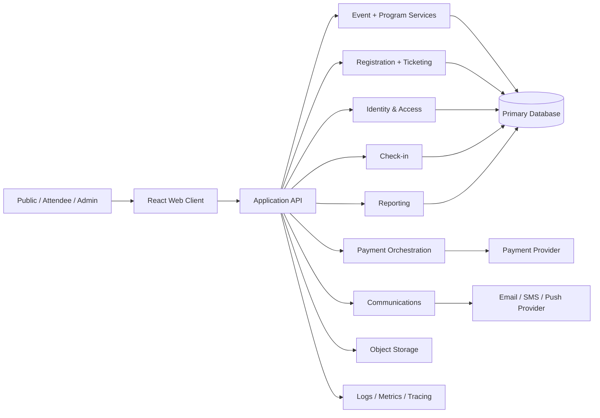
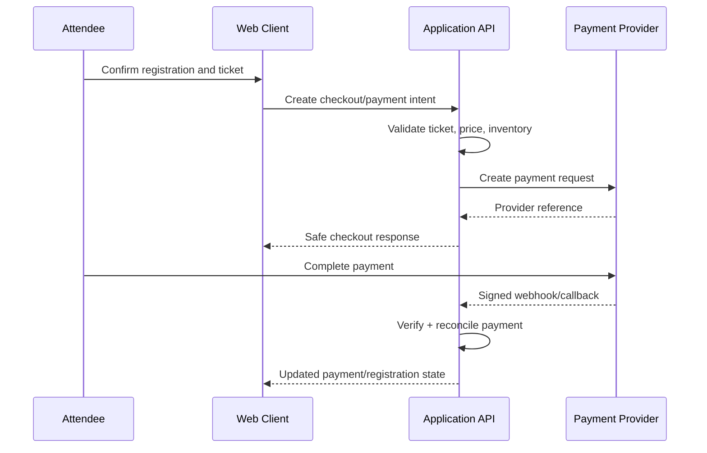

# System Engineering — NeuroTech Events

This document defines the engineering boundaries for evolving the current frontend prototype into a production event-management system without coupling the UI to unverified infrastructure assumptions.

## 1. Current system baseline

The repository currently contains a **client-side React prototype** built with React 19, TypeScript, Vite, Framer Motion, and Oxlint.

The present application has three logical surfaces:

- public visitor;
- registered attendee;
- administrator.

Navigation and demo product data currently live behind `src/app/` routing and `src/repositories/`. Prototype HTML composition remains in `src/design/` for reference.

At this stage, the repository does **not** establish a production backend, database, identity provider, payment gateway, notification service, or event analytics pipeline. Any such integration must therefore be introduced behind explicit contracts rather than assumed.

## 2. Product domains

The system should be decomposed around the following domains.

| Domain | Core responsibility |
| --- | --- |
| Events | Event metadata, venue, dates, lifecycle, publishing |
| Program | Sessions, speakers, rooms, tracks, schedules |
| Registration | Attendee registration and registration status |
| Ticketing | Ticket types, pricing, availability, ticket ownership |
| Payments | Checkout intent, payment state, reconciliation, receipts |
| Attendees | Profiles, preferences, participation records |
| Check-in | QR/code validation, attendance/check-in records |
| Networking | Attendee discovery and connection requests |
| Communications | Notifications, announcements, transactional messaging |
| Sponsors | Sponsor profiles, tiers, event placements |
| Certificates | Eligibility, issuance, verification |
| Reporting | Operational and business metrics |
| Identity & access | Authentication, roles, permissions, sessions |

Domain boundaries should remain explicit even if the first production backend is a modular monolith.

## 3. Recommended target architecture

The following is the recommended production direction, not a claim about infrastructure that already exists.



### Initial deployment recommendation

Start with a **modular monolith** unless scale or organizational boundaries require separate services. Keep domain modules internally separated and expose one versioned API. This reduces deployment complexity while preserving a path to later extraction.

## 4. Frontend architecture direction

The frontend should gradually move from a prototype-oriented layout toward domain-oriented implementation.

Recommended structure:

```text
src/
  app/
    router/
    providers/
  components/
    ui/
    layout/
  features/
    events/
    registration/
    tickets/
    payments/
    attendees/
    checkin/
    networking/
    admin/
  services/
    api/
    auth/
    telemetry/
  domain/
    event.ts
    ticket.ts
    payment.ts
    attendee.ts
  lib/
  design/
```

The existing `design/` directory should be treated as a reference/prototype source. Production business behavior should not become dependent on raw design artifacts unless that renderer is intentionally retained as a supported architecture.

## 5. Data contracts

Before integrating a backend, define stable frontend-facing contracts.

Minimum entities:

```ts
interface Event {
  id: string;
  slug: string;
  title: string;
  status: "draft" | "published" | "cancelled" | "completed";
  startsAt: string;
  endsAt: string;
  venue?: Venue;
}

interface TicketType {
  id: string;
  eventId: string;
  name: string;
  price: number;
  currency: string;
  capacity?: number;
  salesStart?: string;
  salesEnd?: string;
}

interface Registration {
  id: string;
  eventId: string;
  attendeeId: string;
  ticketTypeId: string;
  status: "pending" | "confirmed" | "cancelled";
}

interface Payment {
  id: string;
  registrationId: string;
  status: "pending" | "processing" | "paid" | "failed" | "refunded";
  amount: number;
  currency: string;
}
```

These are baseline examples. The backend contract remains authoritative once an API specification is approved.

## 6. API design principles

- Version production APIs, e.g. `/api/v1`.
- Use opaque identifiers; do not expose database implementation details unnecessarily.
- Make mutation endpoints idempotent where retries are expected, especially registration and payment operations.
- Use server-generated timestamps.
- Return machine-readable error codes plus safe human-readable messages.
- Separate authentication failures (`401`) from authorization failures (`403`).
- Paginate list endpoints that can grow.
- Do not trust client-supplied price, permission, or payment-status values.
- Validate all request payloads server-side.

Example resource direction:

```text
GET    /api/v1/events
GET    /api/v1/events/{eventId}
GET    /api/v1/events/{eventId}/sessions
POST   /api/v1/events/{eventId}/registrations
GET    /api/v1/me/tickets
POST   /api/v1/payments/intents
POST   /api/v1/check-ins
GET    /api/v1/admin/events/{eventId}/attendees
```

Do not implement these routes in the frontend until the corresponding backend contract exists.

## 7. Identity and authorization

Recommended roles at minimum:

- anonymous/public visitor;
- attendee;
- event staff/check-in operator;
- event administrator;
- platform administrator, if multi-event administration requires it.

Authorization must be evaluated server-side for protected operations. Frontend role checks exist for UX only and are not a security boundary.

Prefer short-lived access credentials and secure session handling. Avoid storing long-lived sensitive tokens in `localStorage` when safer session mechanisms are available.

## 8. Payment engineering

Payments require a backend orchestration layer.

Expected flow:



Requirements:

- never treat a browser redirect alone as proof of payment;
- verify provider callbacks/webhooks server-side;
- use idempotency keys for retry-sensitive payment operations;
- store provider references, not sensitive payment credentials;
- maintain an auditable payment state history;
- reconcile mismatched/late callbacks.

## 9. Ticketing and check-in

A ticket should be issued only after the system reaches the required registration/payment state.

For QR/check-in:

- encode a non-sensitive ticket/check-in identifier, preferably signed or server-verifiable;
- validate on the server where connectivity allows;
- reject replay/duplicate check-ins according to event policy;
- capture check-in timestamp and operator/device context where appropriate;
- support a defined offline-mode strategy only if it is explicitly required.

## 10. Security requirements

### Client

- no secrets in source or committed `.env` files;
- prevent unsafe URL schemes;
- avoid rendering untrusted HTML without sanitization;
- validate file types/sizes before upload UX;
- minimize sensitive data retained in browser storage.

### Server

- validate and normalize all input;
- rate-limit authentication, registration, payment, and check-in endpoints;
- enforce RBAC/ABAC server-side;
- protect against IDOR by checking resource ownership/permissions;
- use parameterized database access/ORM safeguards;
- encrypt transport with TLS;
- maintain secret rotation and environment separation;
- verify payment/notification provider signatures.

### Data protection

Collect only data necessary for event operations. Define retention rules for attendee data, payment references, logs, certificates, and exports before production launch.

## 11. Reliability and failure handling

The system must treat the following as normal operational conditions:

- mobile connectivity loss;
- delayed payment callbacks;
- duplicate client submissions;
- provider timeouts;
- sold-out ticket race conditions;
- expired sessions;
- stale admin data;
- duplicate check-in scans.

Design operations to be idempotent where possible and surface recoverable states to the user.

For ticket inventory, capacity checks must be enforced transactionally on the server to prevent overselling.

## 12. Observability

Production should provide:

- structured application logs;
- request correlation IDs;
- frontend error capture;
- API latency/error metrics;
- payment lifecycle metrics;
- registration conversion metrics;
- check-in success/failure metrics;
- audit logs for sensitive admin operations.

Do not log secrets, full credentials, or unnecessary attendee personal data.

## 13. Environments

Recommended minimum environments:

| Environment | Purpose |
| --- | --- |
| local | developer implementation |
| preview/staging | PR/integration validation |
| production | live event operations |

Configuration must be environment-driven. Production credentials must never be copied into local config or source control.

## 14. Quality gates

Before deployment, target the following gates:

- TypeScript build passes;
- lint passes;
- unit/integration tests pass when introduced;
- critical registration/payment/check-in journeys are covered by end-to-end tests;
- dependency/security review completes;
- accessibility review for attendee/public journeys;
- responsive validation across target mobile/desktop sizes;
- rollback path exists.

## 15. Architecture decision records

Significant architecture decisions should be recorded under `docs/adr/` using a short ADR containing:

- context;
- decision;
- alternatives considered;
- consequences;
- status/date.

Examples requiring an ADR:

- backend framework and hosting;
- database choice;
- authentication/session strategy;
- payment provider;
- QR/check-in strategy;
- whether the design-block renderer remains part of production architecture.

## 16. Engineering principle

The current UI prototype is valuable product evidence, but production implementation should proceed by **contract first, boundary first, then integration**. Preserve the working experience while replacing mock state with explicit domain models and independently testable system layers.
